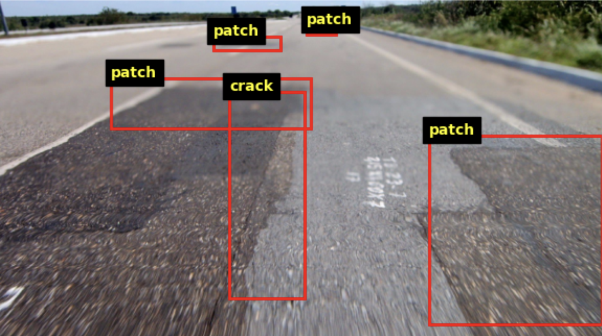
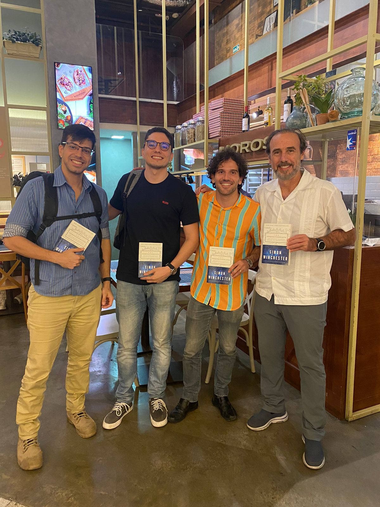
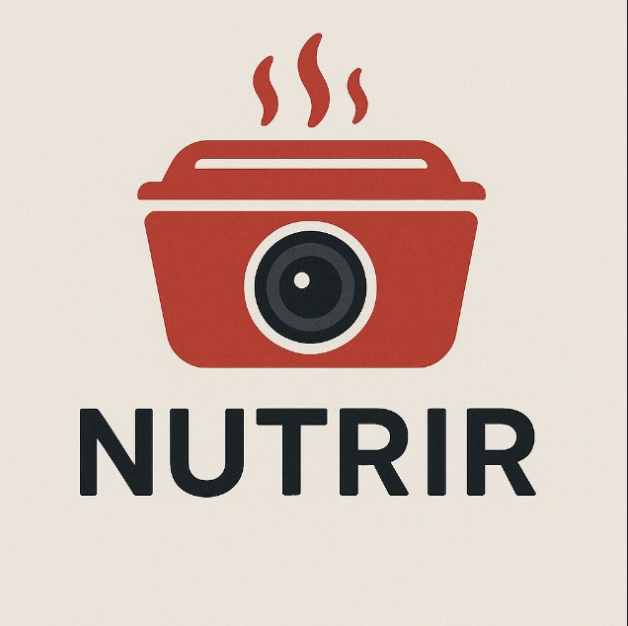
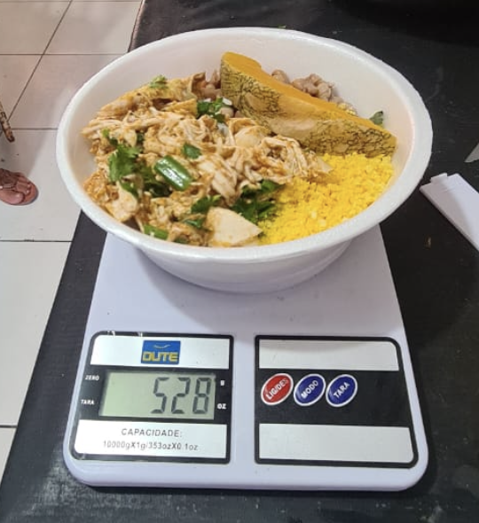
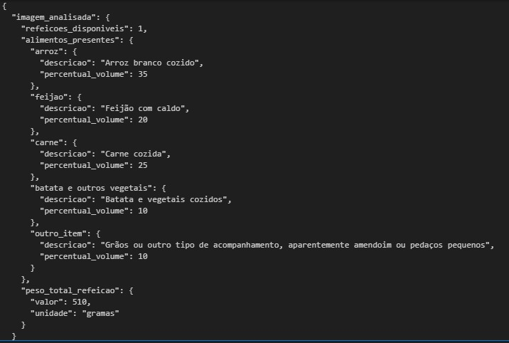
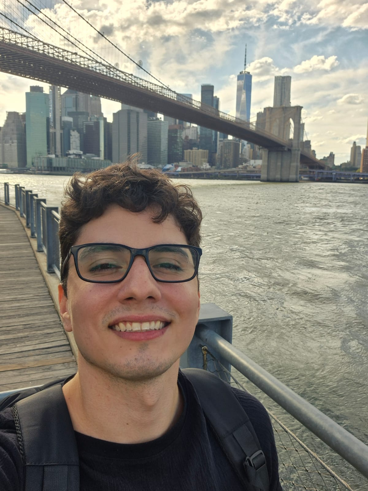

# Hi, I’m **Klayver**

**AI Specialist / Data Scientist**  
📍 Fortaleza, Brazil 🇧🇷 & New York, USA 🇺🇸  
📧 [klayverpaz@gmail.com](mailto:klayverpaz@gmail.com)  
🌐 [Portfolio](https://klayverpaz.github.io/) · [LinkedIn](https://www.linkedin.com/in/klayverpaz/) · [GitHub](https://github.com/klayverpaz)

---

### About Me  
Data Scientist and Software Developer bridging research precision with industry execution and pragmatism.  
I design AI systems that transform complex data into actionable insight — driven by curiosity, scientific rigor, and creative thinking.

---

### Current Work  
**🔹 Research Scientist – Data Science | [VIDA Center, NYU Tandon](https://vida.engineering.nyu.edu/)**  
Contributing to *UrbanMapper*, a large-scale urban analytics framework for spatial-temporal modeling and decision support.

- Applied Bayesian modeling and geospatial analytics (GeoPandas, Rasterio).  
- Developed dasymetric mapping pipelines for urban data.  
- Collaborated across engineering and data science teams.

---

### Previous Experience  

**Data Scientist | [Atlântico](https://www.atlantico.com.br/)**  
Developed NLP and anomaly detection systems for industrial and operational analytics.  
- Built RAG-based NLP solutions using OLLAMA and GPTs.  
- Designed forecasting algorithms for industrial time series.  
- Deployed APIs and dashboards within Azure Cloud architecture.  

**Data Scientist & Software Developer | [Agilean](https://www.agilean.com.br/)**  
Created predictive analytics and integration systems for construction and industrial data.  
- Forecasted waste and delays using ML models.  
- Built ETL pipelines on Azure Data Factory.  
- Developed APIs and dashboards with C#, Python, and Power BI.  

**Research Scientist | [Chief Scientist Program – FUNCAP](https://www.funcap.ce.gov.br/cientista-chefe-de-infraestrutura)**  
Developed computer vision models for road defect detection using YOLO and TensorFlow.  
- Built scalable data pipelines and segmentation models.  
- Delivered AI systems adopted for public infrastructure monitoring.

---

### 🚀 Featured Projects  

**🛣 [Midr – Computer Vision for Roads Distress Detection](https://www.instagram.com/reel/C6wSjDZo3jv/?utm_source=ig_web_copy_link&igsh=MzRlODBiNWFlZA==)**  
YOLO-based detection algorithm for highway maintenance.  
> 🏆 Patented and adopted as the official road inspection system by the Court of Accounts of Ceará, Brazil.

  
  
  

**🍱 Nutrir – Computer Vision for Meals Verification**  
AI system to verify and analyze meal distribution for vulnerable populations.  
> Adopted by the Municipality of Fortaleza, Brazil.

  
  
  

---

### Technical Skills  

- **Languages & Frameworks:** Python, C#, .NET, SQL  
- **AI & Data Science:** PyTorch, TensorFlow, Scikit-learn, NLP (RAG, GPT, Ollama)  
- **Cloud & Engineering:** Azure, Databricks, Microsoft Fabric, APIs & Microservices  
- **Visualization:** Power BI, Tableau, Matplotlib, Plotly  
- **Geospatial Analytics:** GeoPandas, Rasterio, Spatial Modeling  

---

### Research and Education  

- **Research Scientist** – [NYU Tandon, VIDA Center](https://engineering.nyu.edu/)  
  *Urban Science & Data Science Research*  

- **B.Sc. Civil Engineering** – [Federal University of Ceará (UFC)](https://www.ufc.br/)  

---

### Interests  

- **AI:** AI automation, Computer Vision, LLMs.  
- **Economics:** Incentives, complexity, and data-driven decision-making.  
- **Game Theory:** Strategic behavior in AI and human systems.  
- **Kickboxing:** Practitioner and competitor (Blue Belt, 5th of 7 ranks).  

---

### 🗣 Languages  

🇬🇧 English – Native  
🇧🇷 Portuguese – Native  

---

  

